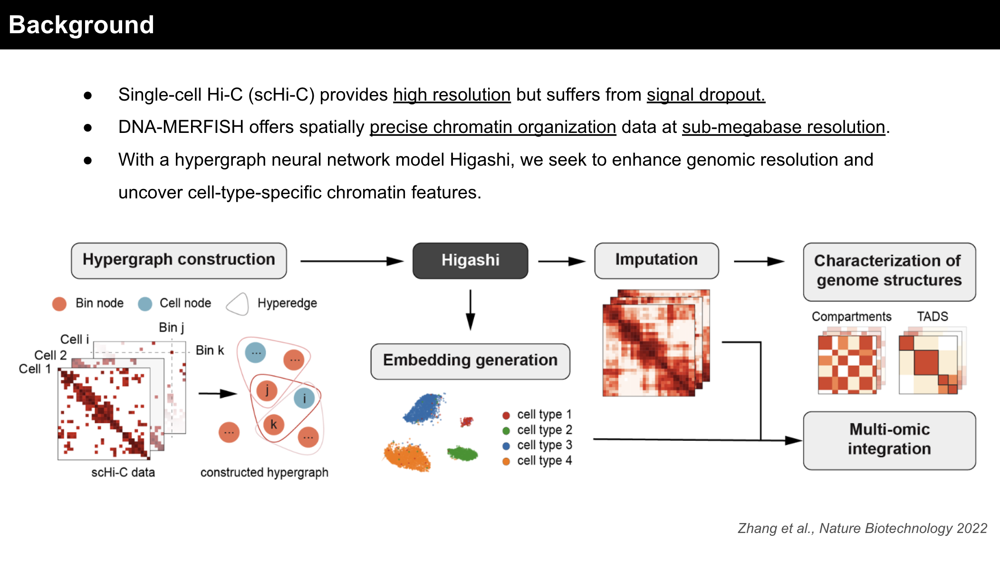

# Joint integration of scHi-C and DNA-MERFISH modalities using hypergraph neural network

## Abstract 

Understanding chromatin organization is fundamental to elucidating the relationship between 3D genome structure and gene regulation. Single-cell Hi-C (scHi-C) provides genome-wide chromatin interaction maps with high resolution but suffers from signal dropout, while DNA-MERFISH offers spatially precise chromatin organization data at sub-megabase resolution. By integrating these complementary datasets using the hypergraph neural network model Higashi, we seek to enhance genomic resolution and uncover cell-type-specific chromatin features. In this study, we demonstrated successful embedding creation for scHi-C and the feasibility of integrating spatially resolved DNA-MERFISH data. We proposed a joint embedding strategy to enhance data imputation and improve resolution. By identifying topologically associated domains (TADs), A/B compartments, and other chromatin features we can reveal cell-type-specific regulatory mechanisms. Our approach represents a novel application of Higashi for multi-modal data integration, providing a roadmap for leveraging single-cell and spatial genomics data to achieve higher-resolution insights into chromatin architecture.

